# ChalkyLayout

Simple Rails admin UI components with intuitive helper methods.

## Installation

Add to your Gemfile:

```ruby
gem 'chalky_layout', git: 'https://github.com/ChalkyOrg/chalky_layout.git'

# Required dependencies
gem 'view_component'
gem 'slim-rails'
```

Then run:

```bash
bundle install
rails generate chalky_layout:install
```

## Quick Start

Helper methods are automatically available in all views:

```slim
= chalky_page do |page|
  - page.with_header(title: "Utilisateurs", subtitle: "Gestion des comptes") do |header|
    - header.with_actions do
      = link_to new_user_path do
        = chalky_icon_button(label: "Nouveau", icon: "fa-solid fa-plus")

  - page.with_body do
    = chalky_card do
      = chalky_heading(title: "Liste des utilisateurs")
      = chalky_grid(rows: @users) do |grid|
        - grid.text(label: "Nom", method: :name, priority: :primary)
        - grid.text(label: "Email", method: :email)
        - grid.badge(label: "Rôle", method: :role, color: :blue)
```

## Page Layout

### `chalky_page`

Main page wrapper with header and body slots.

```slim
= chalky_page do |page|
  - page.with_header(title: "Page Title", subtitle: "Optional subtitle") do |header|
    - header.with_actions do
      / Action buttons here

  - page.with_body do
    / Main content here
```

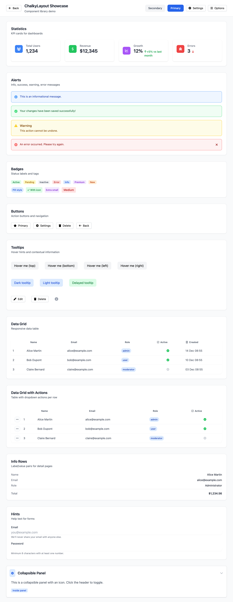

**Parameters:**
| Parameter | Type | Default | Description |
|-----------|------|---------|-------------|
| `title` | String | `nil` | Page title (used if no header slot) |
| `subtitle` | String | `nil` | Page subtitle |
| `css_classes` | String | `""` | Additional CSS classes |
| `data_attributes` | Hash | `{}` | Data attributes |

### Header Slot

The header is a sticky title bar with back button, title, subtitle, and actions.

```slim
- page.with_header(title: "Users", subtitle: "Manage accounts", backlink: true) do |header|
  - header.with_actions do
    = link_to new_user_path do
      = chalky_icon_button(label: "Add", icon: "fa-solid fa-plus")
    = link_to export_users_path do
      = chalky_icon_button(label: "Export", icon: "fa-solid fa-download")
```


**Header Parameters:**
| Parameter | Type | Default | Description |
|-----------|------|---------|-------------|
| `title` | String | `nil` | Header title |
| `subtitle` | String | `nil` | Header subtitle |
| `backlink` | Boolean | `true` | Show back button |
| `backlink_fallback_url` | String | `"/"` | Fallback URL if no browser history |
| `spacing` | String | `"mb-0"` | Margin classes |

### Body Slot

The body is the main content area with optional full-width mode.

```slim
- page.with_body(full_width: false) do
  = chalky_card do
    / Content here
```

**Body Parameters:**
| Parameter | Type | Default | Description |
|-----------|------|---------|-------------|
| `full_width` | Boolean | `false` | Use full width layout |

### Standalone Components

For custom layouts, use standalone helpers:

```slim
/ Custom layout without chalky_page
= chalky_title_bar(title: "Custom Page", backlink: false) do |header|
  - header.with_actions do
    = link_to path do
      = chalky_icon_button(label: "Action", icon: "fa-solid fa-cog")

= chalky_content(full_width: true) do
  / Full-width content

= chalky_actions(layout: :center) do
  = link_to path do
    = chalky_icon_button(label: "Centered Action", icon: "fa-solid fa-star")
```

## Containers

### `chalky_card`

Simple container with shadow and border.

```slim
= chalky_card do
  p Content inside card

= chalky_card(spacing: "mb-2", css_classes: "bg-blue-50") do
  p Custom spacing and classes
```


**Parameters:**
| Parameter | Type | Default | Description |
|-----------|------|---------|-------------|
| `spacing` | String | `"mb-4 md:mb-8"` | Margin classes |
| `css_classes` | String | `""` | Additional CSS classes |
| `data_attributes` | Hash | `{}` | Data attributes |

### `chalky_panel`

Collapsible section with icon.

```slim
= chalky_panel(title: "Settings", icon: "fa-solid fa-cog", icon_color: :blue) do
  p Panel content here

= chalky_panel(title: "Advanced", icon: "fa-solid fa-wrench", open: false) do
  p Initially collapsed
```


**Parameters:**
| Parameter | Type | Default | Description |
|-----------|------|---------|-------------|
| `title` | String | **required** | Panel title |
| `icon` | String | **required** | Font Awesome icon class |
| `subtitle` | String | `nil` | Optional subtitle |
| `icon_color` | Symbol | `:blue` | Icon color (`:blue`, `:green`, `:red`, etc.) |
| `dom_id` | String | `nil` | DOM ID for the panel |
| `open` | Boolean | `true` | Initially open |

### `chalky_heading`

Section title with optional description and icon.

```slim
= chalky_heading(title: "Section Title")

= chalky_heading(title: "Users", subtitle: "Active accounts only")

= chalky_heading(title: "Settings", icon_path: "fa-solid fa-cog", icon_color: :blue)

= chalky_heading(title: "Products", icon_path: "M20 7l-8-4-8 4m16 0l-8 4m8-4v10l-8 4...", icon_color: :purple)
```

**Parameters:**
| Parameter | Type | Default | Description |
|-----------|------|---------|-------------|
| `title` | String | **required** | Heading title |
| `subtitle` | String | `nil` | Optional description |
| `description` | String | `nil` | Alias for subtitle |
| `icon_path` | String | `nil` | Font Awesome class (e.g., `"fa-solid fa-cog"`) or SVG path data |
| `icon_color` | Symbol | `:blue` | Icon background color (`:blue`, `:green`, `:purple`, `:orange`, `:red`, `:gray`) |
| `spacing` | String | `"mb-6"` | Margin classes |

## Buttons

### `chalky_icon_button`

Button with icon and label, typically used in header actions.

```slim
= link_to users_path do
  = chalky_icon_button(label: "Users", icon: "fa-solid fa-users")

= link_to new_user_path do
  = chalky_icon_button(label: "Add", icon: "fa-solid fa-plus")
```

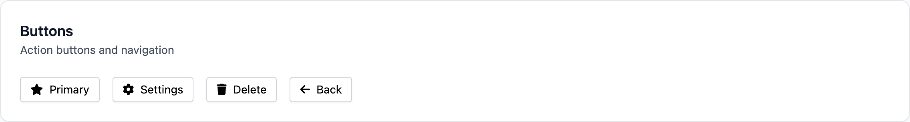

**Parameters:**
| Parameter | Type | Default | Description |
|-----------|------|---------|-------------|
| `label` | String | **required** | Button label |
| `icon` | String | `nil` | Font Awesome icon class |

### `chalky_button`

Form submit button with multiple variants.

```slim
/ Primary (default)
= chalky_button(label: "Save")

/ Secondary
= chalky_button(label: "Cancel", variant: :secondary)

/ Success
= chalky_button(label: "Confirm", variant: :success)

/ Danger
= chalky_button(label: "Delete", variant: :danger)

/ With icon
= chalky_button(variant: :primary, icon_path: "M5 13l4 4L19 7") do
  | Save Changes

/ Different sizes
= chalky_button(label: "Small", size: :sm)
= chalky_button(label: "Medium", size: :md)
= chalky_button(label: "Large", size: :lg)
```

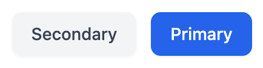

**Parameters:**
| Parameter | Type | Default | Description |
|-----------|------|---------|-------------|
| `label` | String | `nil` | Button label (or use block) |
| `variant` | Symbol | `:primary` | `:primary`, `:secondary`, `:success`, `:danger` |
| `size` | Symbol | `:md` | `:sm`, `:md`, `:lg` |
| `icon_path` | String | `nil` | SVG path for button icon |
| `css_classes` | String | `""` | Additional CSS classes |
| `type` | String | `"button"` | HTML button type |
| `data` | Hash | `{}` | Data attributes |

**Variant Styles:**
| Variant | Description |
|---------|-------------|
| `:primary` | Blue background, white text - main actions |
| `:secondary` | Gray background - cancel/secondary actions |
| `:success` | Green background - confirmation actions |
| `:danger` | Red background - destructive actions |

### `chalky_back`

Back navigation button with JavaScript history support.

```slim
= chalky_back(fallback_url: "/admin")
```


**Parameters:**
| Parameter | Type | Default | Description |
|-----------|------|---------|-------------|
| `fallback_url` | String | `"/"` | URL if no browser history |

## Data Display

### `chalky_grid`

Responsive data table with multiple column types.

```slim
= chalky_grid(rows: @users, details_path: :admin_user_path) do |grid|
  - grid.text(label: "Name", method: :name, priority: :primary)
  - grid.text(label: "Email", method: :email, priority: :secondary)
  - grid.badge(label: "Role", method: :role, color: :blue)
  - grid.boolean(label: "Active", method: :active?)
  - grid.date(label: "Created", method: :created_at, priority: :optional)
```

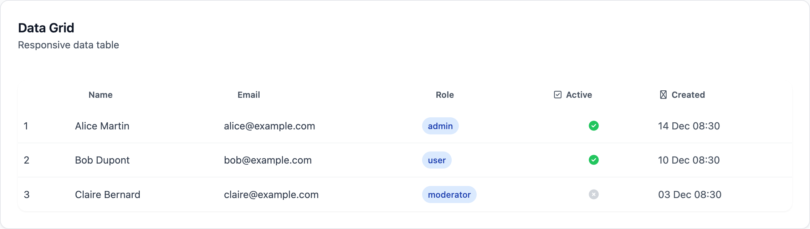

**Grid Parameters:**
| Parameter | Type | Default | Description |
|-----------|------|---------|-------------|
| `rows` | Array | **required** | Data rows to display |
| `details_path` | Symbol | `nil` | Path helper for row links |
| `variant` | Symbol | `:admin` | Grid variant (`:default`, `:simple`, `:admin`) |
| `responsive` | Boolean | `true` | Enable responsive mode |
| `horizontal_scroll` | Boolean | `false` | Enable horizontal scroll |
| `pagy` | Pagy | `nil` | Pagy object for automatic pagination (displays pagination below grid) |

**Column Types - Basic:**

| Type | Description | Extra Parameters |
|------|-------------|------------------|
| `text` | Plain text display | `priority:` |
| `badge` | Colored status badge | `color:` |
| `number` | Formatted number with optional unit | `unit:` |
| `boolean` | Yes/No indicator (check/cross icons) | - |
| `icon` | Conditional icon display | `icon:` (Font Awesome class) |
| `image` | Image thumbnail (ActiveStorage compatible) | `size:` (`:small`, `:medium`, `:large`) |
| `custom` | Custom block for full control | Block required |

**Column Types - Date/Time:**

| Type | Description | Extra Parameters |
|------|-------------|------------------|
| `date` | Date format (I18n localized) | `formatted_as:` (`:default`, `:short`, `:long`) |
| `datetime` | Date and time | `formatted_as:` (`:with_time`, `:relative`, `:default`) |

**Column Types - Interactive:**

| Type | Description | Extra Parameters |
|------|-------------|------------------|
| `link` | Clickable link to another page | `path:` (route helper symbol) |
| `select` | Select/dropdown column | `data_type:` (`:enumerize` for Enumerize gem) |
| `formula` | Calculated/formula column | - |
| `modal_data` | Link opening a modal | `path:` (route helper symbol) |
| `project_files` | File attachments display | - |
| `price_range` | Price range display | - |
| `status_icon` | Status indicator icon | - |
| `stock_management` | Stock +/- buttons | - |

**Column Types - Associations:**

| Type | Description | Extra Parameters |
|------|-------------|------------------|
| `references` | Display referenced records | `formatted_as:` |
| `users` | Display user avatars/names | - |
| `lookups` | Lookup field display | - |

**Badge Colors:** `:green`, `:red`, `:blue`, `:yellow`, `:purple`, `:orange`, `:gray`

**Column Priority:**
- `:primary` - Always visible, used as card title on mobile
- `:secondary` - Default, shown in card body on mobile
- `:optional` - Only on large screens

**Nested Attribute Access:**

You can access nested attributes using dot notation:

```slim
= chalky_grid(rows: @orders) do |grid|
  - grid.text(label: "Customer", method: "user.full_name", priority: :primary)
  - grid.text(label: "Email", method: "user.email")
  - grid.text(label: "City", method: "address.city")
```

**Using Procs for Dynamic Values:**

You can pass a Proc instead of a method name for complex data access:

```slim
= chalky_grid(rows: @orders) do |grid|
  - grid.text(label: "Total", method: ->(order) { number_to_currency(order.total) })
  - grid.badge(label: "Status", method: ->(order) { order.paid? ? "Paid" : "Pending" }, color: :green)
```

### Grid Actions

Add row actions with dropdown menu:

```slim
= chalky_grid(rows: @users) do |grid|
  - grid.action(name: "View", path: :user_path, icon: "fa-solid fa-eye")
  - grid.action(name: "Edit", path: :edit_user_path, icon: "fa-solid fa-pen")
  - grid.action(name: "Delete", path: :user_path, icon: "fa-solid fa-trash", data: { method: :delete, confirm: "Are you sure?" })
  - grid.text(label: "Name", method: :name, priority: :primary)
  - grid.text(label: "Email", method: :email)
```

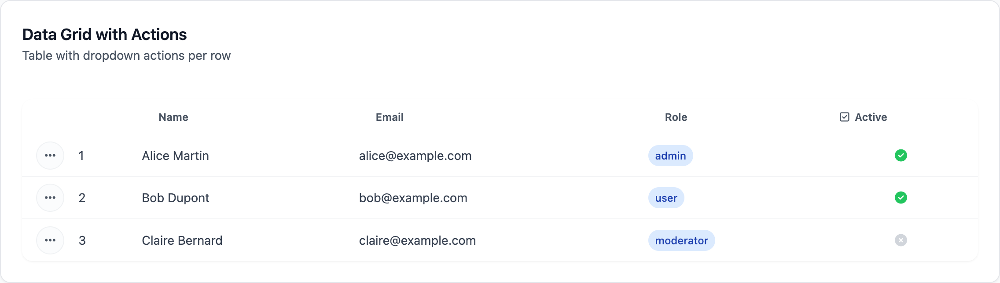

**Action Parameters:**
| Parameter | Type | Description |
|-----------|------|-------------|
| `name` | String | Action label |
| `path` | Symbol | Route helper name (e.g., `:edit_user_path`) |
| `icon` | String | Font Awesome icon class |
| `data` | Hash | Data attributes (`:method`, `:confirm`, etc.) |
| `options[:id_method]` | Symbol | Method to get row ID (default: `:id`) |
| `options[:id_param_key]` | Symbol | Param key for ID (default: `:id`) |
| `options[:unless]` | Symbol/Proc | Condition to hide action |
| `options[:variant]` | Symbol | `:admin` or `:danger` |

### Custom Column Example

```slim
= chalky_grid(rows: @orders) do |grid|
  - grid.text(label: "ID", method: :id)
  - grid.custom(label: "Total") do |order|
    span.font-bold = number_to_currency(order.total)
  - grid.custom(label: "Actions") do |order|
    = link_to "View", admin_order_path(order)
```

### Grid with Pagination

You can add pagination to a grid by passing a Pagy object:

```slim
= chalky_grid(rows: @users, pagy: @pagy, details_path: :admin_user_path) do |grid|
  - grid.text(label: "Name", method: :name, priority: :primary)
  - grid.text(label: "Email", method: :email)
  - grid.badge(label: "Role", method: :role, color: :blue)
```

The pagination component will be automatically displayed below the grid when there are multiple pages.

### Grid Advanced Options

#### Grid Variants

Three visual variants are available:

```slim
/ Default - rounded corners with shadow
= chalky_grid(rows: @users, variant: :default) do |grid|
  ...

/ Simple - minimal styling, no rounded corners
= chalky_grid(rows: @users, variant: :simple) do |grid|
  ...

/ Admin - optimized for admin interfaces (default)
= chalky_grid(rows: @users, variant: :admin) do |grid|
  ...
```

#### Custom Row Styling

Apply custom CSS classes to rows conditionally:

```slim
= chalky_grid(rows: @orders, row_classes_proc: ->(row) { row.urgent? ? "bg-red-50" : "" }) do |grid|
  - grid.text(label: "Order", method: :number)
```

#### Custom Row Data Attributes

Add data attributes to each row dynamically:

```slim
= chalky_grid(rows: @items, row_data_attributes: ->(row) { { id: row.id, category: row.category } }) do |grid|
  - grid.text(label: "Name", method: :name)
```

#### Index Badge (Row Numbering)

Customize the row index badge appearance:

```slim
= chalky_grid(rows: @items, index_badge_proc: ->(row) { row.featured? ? "bg-yellow-200" : nil }) do |grid|
  - grid.text(label: "Name", method: :name)
```

#### Details Path with Custom ID

Link each row to a detail page using a custom ID method:

```slim
= chalky_grid(rows: @products, details_path: :admin_product_path, details_path_id_method: :slug) do |grid|
  - grid.text(label: "Name", method: :name)
```

**Advanced Grid Parameters:**

| Parameter | Type | Default | Description |
|-----------|------|---------|-------------|
| `variant` | Symbol | `:admin` | Grid style (`:default`, `:simple`, `:admin`) |
| `details_path_id_method` | Symbol | `:id` | Method to get row ID for links |
| `row_count_key` | Symbol | `nil` | Method for row count display |
| `details_path_attributes` | Hash | `{}` | Extra attributes for row links |
| `css_classes` | String | `""` | Additional CSS classes for table |
| `bulk_selection` | Boolean | `false` | Enable checkbox selection |
| `row_data_attributes` | Proc | `nil` | Proc returning data attrs per row |
| `row_classes_proc` | Proc | `nil` | Proc returning CSS classes per row |
| `index_badge_proc` | Proc | `nil` | Proc returning badge classes per row |

### `chalky_pagination`

Standalone pagination component for use outside of grids. Requires the [Pagy](https://github.com/ddnexus/pagy) gem.

```slim
= chalky_pagination(pagy: @pagy)

/ With custom URL builder
= chalky_pagination(pagy: @pagy, url_builder: ->(page) { users_path(page: page, search: params[:search]) })
```

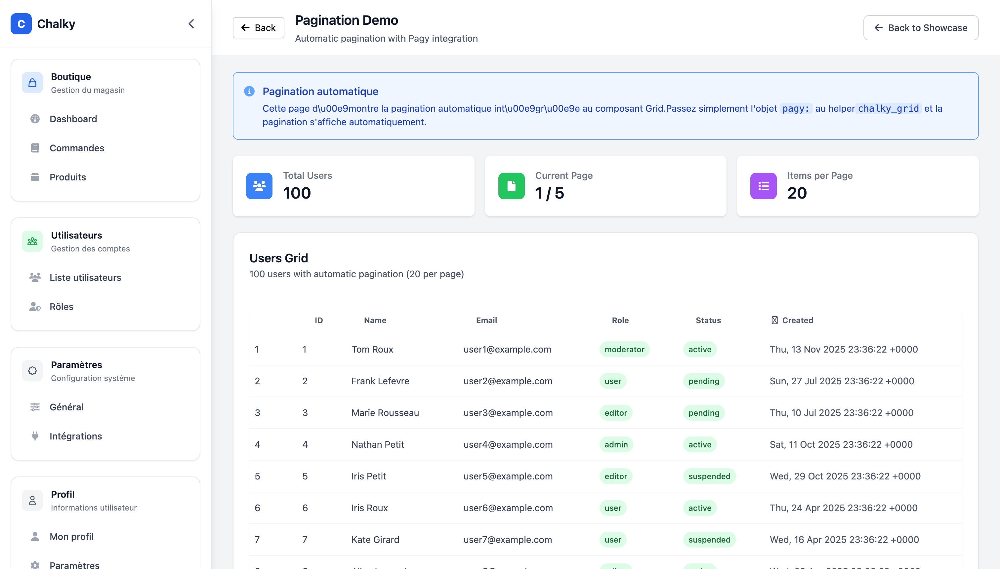

**Parameters:**
| Parameter | Type | Default | Description |
|-----------|------|---------|-------------|
| `pagy` | Pagy | **required** | Pagy object containing pagination info |
| `url_builder` | Proc | `nil` | Custom proc to build page URLs (receives page number) |

**Features:**
- First, previous, next, last page buttons
- Page number display with ellipsis for large page counts
- Responsive: shows "Page X of Y" on desktop, "X-Y of Total" on mobile
- Turbo-compatible with `data-turbo-action="replace"`
- Only renders when there are multiple pages

**Controller Setup:**
```ruby
# In your controller
include Pagy::Backend

def index
  @pagy, @users = pagy(User.all, items: 25)
end
```

## Interactive

### `chalky_dropdown`

Dropdown menu component with trigger and items.

```slim
/ Basic dropdown with items
= chalky_dropdown(pop_direction: :left) do |dropdown|
  - dropdown.with_trigger do
    = chalky_icon_button(label: "Options", icon: "fa-solid fa-ellipsis-v")
  - dropdown.with_item(href: edit_path, icon: "fa-solid fa-pen") do
    | Edit
  - dropdown.with_item(href: delete_path, icon: "fa-solid fa-trash", variant: :danger, method: :delete, confirm: "Are you sure?") do
    | Delete

/ Dropdown with divider and text
= chalky_dropdown do |dropdown|
  - dropdown.with_trigger do
    = chalky_icon_button(label: "Actions", icon: "fa-solid fa-ellipsis-v")
  - dropdown.with_item(href: view_path, icon: "fa-solid fa-eye") do
    | View
  - dropdown.with_item(type: :divider)
  - dropdown.with_item(type: :text) do
    | Danger Zone
  - dropdown.with_item(href: delete_path, variant: :danger, method: :delete) do
    | Delete
```


**Parameters:**
| Parameter | Type | Default | Description |
|-----------|------|---------|-------------|
| `variant` | Symbol | `:admin` | Dropdown variant (`:primary`, `:secondary`, `:admin`) |
| `pop_direction` | Symbol | `:right` | Menu direction (`:right`, `:left`) |
| `css_classes` | String | `""` | Additional CSS classes |

**Slots:**
| Slot | Description |
|------|-------------|
| `with_trigger` | Element that opens the dropdown (required) |
| `with_item` | Menu item (can have multiple) |

**Item Parameters (`with_item`):**
| Parameter | Type | Default | Description |
|-----------|------|---------|-------------|
| `href` | String | `nil` | Link URL |
| `icon` | String | `nil` | Font Awesome icon class |
| `type` | Symbol | `:link` | Item type: `:link`, `:button`, `:divider`, `:text` |
| `variant` | Symbol | `:admin` | Item variant: `:admin`, `:danger`, `:primary` |
| `method` | Symbol | `:get` | HTTP method (`:get`, `:post`, `:delete`, etc.) |
| `confirm` | String | `nil` | Turbo confirmation message |
| `css_classes` | String | `""` | Additional CSS classes |

## UI Elements

### `chalky_badge`

Colored label for status, tags, categories.

```slim
= chalky_badge(label: "Active", color: :green)
= chalky_badge(label: "Pending", color: :yellow, style: :pill)
= chalky_badge(label: "Error", color: :red, icon: "fa-solid fa-xmark")
```

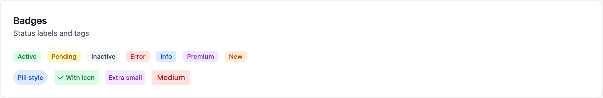

**Parameters:**
| Parameter | Type | Default | Description |
|-----------|------|---------|-------------|
| `label` | String | **required** | Badge text |
| `color` | Symbol | `:gray` | `:gray`, `:green`, `:red`, `:blue`, `:yellow`, `:orange`, `:purple` |
| `size` | Symbol | `:sm` | `:xs`, `:sm`, `:md` |
| `style` | Symbol | `:rounded` | `:rounded`, `:pill` |
| `icon` | String | `nil` | Optional Font Awesome icon |

### `chalky_stat`

KPI card for dashboards with icon, value, and optional trend.

```slim
.grid.grid-cols-4.gap-6
  = chalky_stat(label: "Total Users", value: 1234, icon: "fa-solid fa-users", icon_color: :blue)
  = chalky_stat(label: "Revenue", value: "$12,345", icon: "fa-solid fa-dollar-sign", icon_color: :green)
  = chalky_stat(label: "Growth", value: "12%", icon: "fa-solid fa-chart-line", icon_color: :purple, trend: :up, subtitle: "+5%")
  = chalky_stat(label: "Errors", value: 3, icon: "fa-solid fa-bug", icon_color: :red)
```


**Parameters:**
| Parameter | Type | Default | Description |
|-----------|------|---------|-------------|
| `label` | String | **required** | Metric label |
| `value` | String/Number | **required** | Metric value |
| `icon` | String | `nil` | Font Awesome icon class |
| `icon_color` | Symbol | `:blue` | Icon background color |
| `subtitle` | String | `nil` | Additional text below value |
| `trend` | Symbol | `nil` | `:up`, `:down`, or `nil` |

### `chalky_tooltip`

Hover tooltip with HTML content support. Uses slots for trigger and content.

```slim
/ Simple text tooltip
= chalky_tooltip(position: :top) do |tooltip|
  - tooltip.with_trigger do
    i.fa-solid.fa-circle-info.text-gray-400.cursor-help
  - tooltip.with_tooltip_content do
    | More information here

/ Rich HTML tooltip
= chalky_tooltip(position: :bottom, variant: :light) do |tooltip|
  - tooltip.with_trigger do
    = chalky_icon_button(label: "Info", icon: "fa-solid fa-info")
  - tooltip.with_tooltip_content do
    .space-y-2
      .font-bold Product Details
      p.text-sm Includes images, lists, and styled content.
```

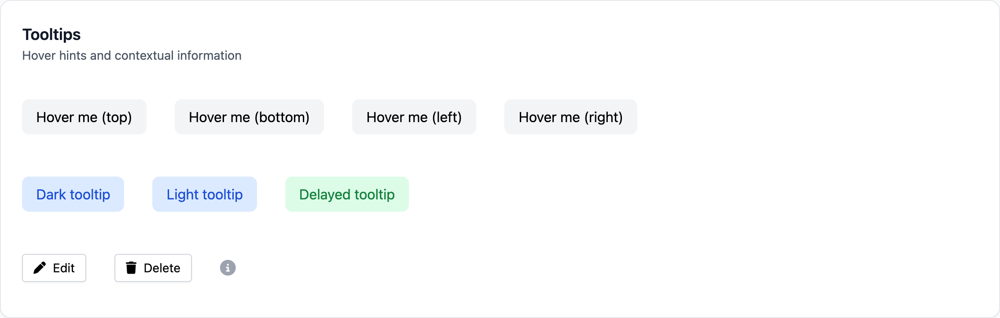

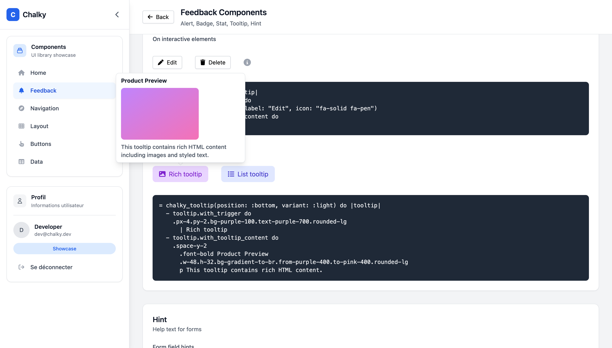

**Parameters:**
| Parameter | Type | Default | Description |
|-----------|------|---------|-------------|
| `position` | Symbol | `:top` | `:top`, `:bottom`, `:left`, `:right` |
| `variant` | Symbol | `:dark` | `:dark` (black bg), `:light` (white bg with border) |
| `delay` | Integer | `0` | Delay in milliseconds before showing |

**Slots:**
| Slot | Description |
|------|-------------|
| `with_trigger` | Element that triggers the tooltip on hover (required) |
| `with_tooltip_content` | Tooltip content - can be text or rich HTML (required) |

### `chalky_hint`

Small help text typically shown below form fields.

```slim
= chalky_hint(text: "Enter a valid email address")
= chalky_hint(text: "Maximum 100 characters", size: :sm)
= chalky_hint do
  | Custom hint with
  strong  bold text
```

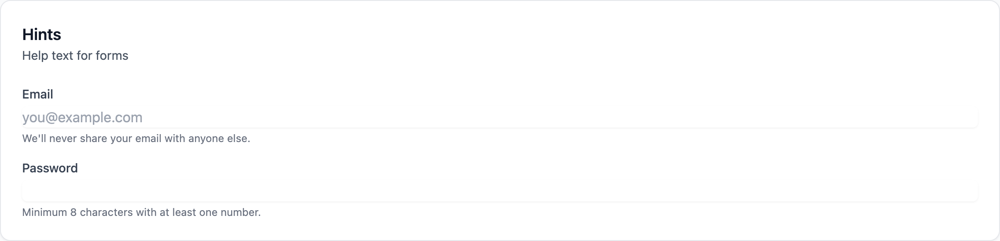

**Parameters:**
| Parameter | Type | Default | Description |
|-----------|------|---------|-------------|
| `text` | String | `nil` | Hint text (or use block) |
| `size` | Symbol | `:xs` | `:xs`, `:sm` |
| `icon` | String | `nil` | Optional icon |

### `chalky_alert`

Info, warning, success, or error message box.

```slim
= chalky_alert(message: "Your changes have been saved", variant: :success)

= chalky_alert(title: "Warning", message: "This action cannot be undone", variant: :warning)

= chalky_alert(variant: :info, style: :left_border) do
  ul
    li First instruction
    li Second instruction

= chalky_alert(variant: :error, dismissible: true) do
  | An error occurred. Please try again.
```


**Parameters:**
| Parameter | Type | Default | Description |
|-----------|------|---------|-------------|
| `message` | String | `nil` | Alert message (or use block) |
| `title` | String | `nil` | Optional alert title |
| `variant` | Symbol | `:info` | `:info`, `:success`, `:warning`, `:error` |
| `style` | Symbol | `:default` | `:default`, `:left_border` |
| `icon` | String | `nil` | Custom icon (defaults by variant) |
| `dismissible` | Boolean | `false` | Show dismiss button |

### `chalky_info_row`

Label/value display pair for detail pages.

```slim
= chalky_card do
  .space-y-2
    = chalky_info_row(label: "Name", value: @user.name)
    = chalky_info_row(label: "Email", value: @user.email)
    = chalky_info_row(label: "Role", value: @user.role.humanize)
    = chalky_info_row(label: "Total", value: number_to_currency(@order.total), separator: true, bold_value: true)
```

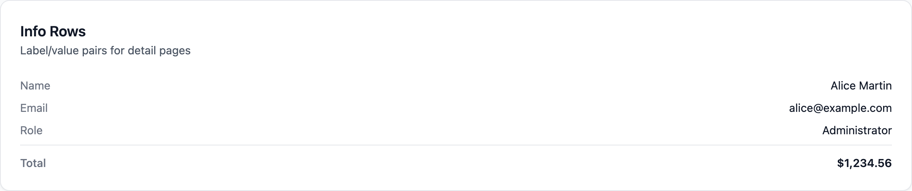

**Parameters:**
| Parameter | Type | Default | Description |
|-----------|------|---------|-------------|
| `label` | String | **required** | Row label |
| `value` | String | `nil` | Row value (or use block) |
| `separator` | Boolean | `false` | Add top border separator |
| `bold_value` | Boolean | `false` | Make value bold (for totals) |

### `chalky_tabs`

Navigation tabs for page sections. Typically used inside the header's navigation slot.

```slim
= chalky_page do |page|
  - page.with_header(title: "Products") do |header|
    - header.with_navigation do
      = chalky_tabs(tabs: [
        {name: "Articles", path: admin_items_path},
        {name: "Collections", path: admin_collections_path},
        {name: "Categories", path: admin_categories_path}
      ])
```


**Tab Options:**
| Option | Type | Description |
|--------|------|-------------|
| `name` | String | Tab label (required) |
| `path` | String | Tab URL or anchor (required) |
| `icon` | String | Optional Font Awesome icon class |
| `badge` | Integer | Optional badge count (e.g., notifications) |
| `default` | Boolean | Set to true for default active anchor tab |
| `active_param` | String | Query param name for active detection |
| `active_value` | String | Query param value for active detection |

**Smart Tab Behavior:**
- **Anchor tabs** (`#section`): Client-side switching with Stimulus, no page reload
- **URL tabs** (`/admin/users`): Standard Rails navigation with active state detection

```slim
/ Mixed example: anchors + URLs
= chalky_tabs(tabs: [
  {name: "Overview", path: "#overview", default: true},  / Anchor - JS switching
  {name: "Details", path: "#details"},                   / Anchor - JS switching
  {name: "Settings", path: admin_settings_path}          / URL - page navigation
])
```

## Sidebar Navigation

Complete sidebar system for admin layouts with mobile support, collapsible sections, menu items, and user profile.

### `chalky_sidebar_layout` (Recommended)

Full-featured sidebar layout with built-in mobile and desktop support. This is the recommended way to create admin layouts.

**Features:**
- Mobile: Hamburger button, overlay, slide-in menu from right
- Desktop: Fixed sidebar with collapse/expand toggle
- localStorage persistence for collapsed state
- Smooth transitions and animations

```slim
= chalky_sidebar_layout(menu_title: "Menu") do |layout|
  - layout.with_header do
    a.flex.items-center.gap-2 href="/"
      .w-8.h-8.bg-blue-600.rounded-lg.flex.items-center.justify-center
        span.text-white.font-bold C
      span.text-lg.font-semibold.text-gray-900 Chalky

  - layout.with_section(title: "Boutique", description: "Gestion du magasin", icon_path: "M16 11V7a4 4 0 00-8 0v4M5 9h14l1 12H4L5 9z", icon_color: :blue) do |section|
    - section.with_menu_item(path: "/admin", title: "Dashboard", icon_classes: "fa-solid fa-gauge")
    - section.with_menu_item(path: "/admin/orders", title: "Commandes", icon_classes: "fa-solid fa-book")
    - section.with_menu_item(path: "/admin/products", title: "Produits", icon_classes: "fa-solid fa-box")

  - layout.with_section(title: "Utilisateurs", icon_path: "M17 20h5v-2a3 3 0 00-5.356-1.857M17 20H7m10 0v-2c0-.656-.126-1.283-.356-1.857M7 20H2v-2a3 3 0 015.356-1.857M7 20v-2c0-.656.126-1.283.356-1.857m0 0a5.002 5.002 0 019.288 0M15 7a3 3 0 11-6 0 3 3 0 016 0z", icon_color: :green) do |section|
    - section.with_menu_item(path: "/admin/users", title: "Utilisateurs", icon_classes: "fa-solid fa-users")

  - layout.with_footer(user_name: current_user.name, user_email: current_user.email, logout_path: logout_path) do |footer|
    - footer.with_menu_item(path: profile_path, title: "Mon profil", icon_classes: "fa-solid fa-user")

  = yield
```

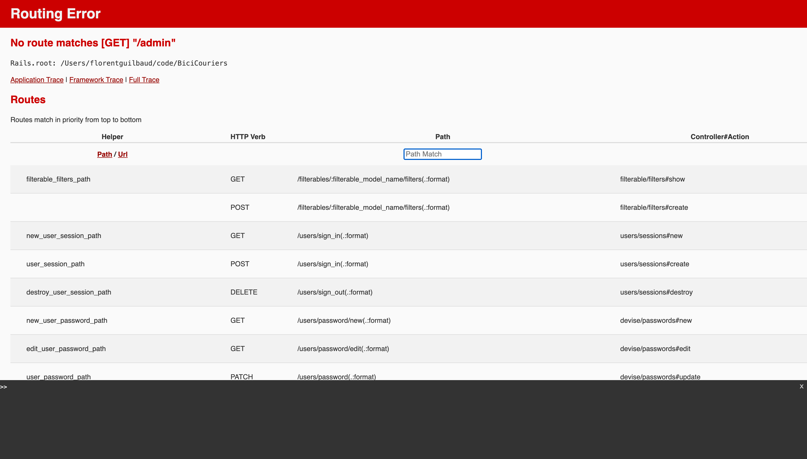

**Parameters:**
| Parameter | Type | Default | Description |
|-----------|------|---------|-------------|
| `menu_title` | String | `"Menu"` | Title shown in mobile menu header |

**Slots:**

| Slot | Description |
|------|-------------|
| `with_header` | Logo/branding area at top of sidebar |
| `with_section` | Navigation section with menu items (can have multiple) |
| `with_footer` | User profile and logout at bottom |

**Section Parameters:**
| Parameter | Type | Default | Description |
|-----------|------|---------|-------------|
| `title` | String | **required** | Section title |
| `icon_path` | String | **required** | SVG path data for the icon |
| `description` | String | `nil` | Optional description below title |
| `icon_color` | Symbol | `:blue` | `:blue`, `:green`, `:purple`, `:orange`, `:red`, `:gray`, `:indigo` |

**Footer Parameters:**
| Parameter | Type | Default | Description |
|-----------|------|---------|-------------|
| `user_name` | String | **required** | User's display name |
| `user_email` | String | **required** | User's email address |
| `logout_path` | String | **required** | Logout URL |
| `avatar_url` | String | `nil` | Avatar image URL (shows initials if nil) |
| `role_label` | String | `nil` | Optional role badge text |
| `role_color` | Symbol | `:gray` | Role badge color |
| `profile_path` | String | `nil` | Optional profile page URL |
| `logout_method` | Symbol | `:delete` | HTTP method for logout |

### `chalky_sidebar_head_script`

Script to prevent FOUC (Flash of Unstyled Content) for sidebar collapsed state. Must be placed in the `<head>` section of your layout.

```slim
head
  / ... other head content ...
  = chalky_sidebar_head_script
```

This script reads localStorage before rendering to apply the collapsed state immediately.

### Complete Layout Example

```slim
doctype html
html.h-full
  head
    title Admin
    = csrf_meta_tags
    = chalky_sidebar_head_script
    = stylesheet_link_tag "application"
    = javascript_importmap_tags

  body.h-full
    = chalky_sidebar_layout(menu_title: "Menu") do |layout|
      - layout.with_header do
        = image_tag "logo.png", class: "h-8"

      - layout.with_section(title: "Navigation", icon_path: "M3 12l2-2m0 0l7-7 7 7M5 10v10a1 1 0 001 1h3m10-11l2 2m-2-2v10a1 1 0 01-1 1h-3m-6 0a1 1 0 001-1v-4a1 1 0 011-1h2a1 1 0 011 1v4a1 1 0 001 1m-6 0h6", icon_color: :blue) do |section|
        - section.with_menu_item(path: admin_root_path, title: "Dashboard", icon_classes: "fa-solid fa-gauge")
        - section.with_menu_item(path: admin_orders_path, title: "Commandes", icon_classes: "fa-solid fa-shopping-cart")
        - section.with_menu_item(path: admin_products_path, title: "Produits", icon_classes: "fa-solid fa-box")

      - layout.with_footer(user_name: current_user.name, user_email: current_user.email, logout_path: logout_path, role_label: "Admin", role_color: :blue) do |footer|
        - footer.with_menu_item(path: profile_path, title: "Profil", icon_classes: "fa-solid fa-user")
        - footer.with_menu_item(path: settings_path, title: "Paramètres", icon_classes: "fa-solid fa-cog")

      = yield
```

---

## Sidebar Menu Items

Menu items are added via the `with_menu_item` method on sections and footers within `chalky_sidebar_layout`.

```slim
- layout.with_section(title: "Navigation", icon_path: "...", icon_color: :blue) do |section|
  - section.with_menu_item(path: admin_orders_path, title: "Commandes", icon_classes: "fa-solid fa-shopping-cart")
  - section.with_menu_item(path: admin_products_path, title: "Produits", icon_path: "M20 7l-8-4-8 4m16 0l-8 4m8-4v10l-8 4")
```

**Menu Item Parameters:**
| Parameter | Type | Default | Description |
|-----------|------|---------|-------------|
| `path` | String | **required** | Link destination URL |
| `title` | String | **required** | Menu item label |
| `icon_classes` | String | `nil` | Font Awesome classes (e.g., `"fa-solid fa-book"`) |
| `icon_path` | String | `nil` | SVG path data (alternative to icon_classes) |
| `active` | Boolean/nil | `nil` | Override active state (`nil` = auto-detect from URL) |

**Icon Options:**
- Use `icon_classes` for Font Awesome icons: `"fa-solid fa-shopping-cart"`
- Use `icon_path` for custom SVG icons: `"M20 7l-8-4-8 4m16 0l-8 4..."`
- If both provided, `icon_path` takes precedence

**Icon Colors (for sections):** `:blue`, `:green`, `:purple`, `:orange`, `:red`, `:gray`, `:indigo`

## Requirements

- Rails 7.0+
- Ruby 3.0+
- ViewComponent gem
- Slim templates
- Tailwind CSS
- Stimulus.js
- Font Awesome (for icons)

## Post-Installation Setup

ChalkyLayout automatically configures itself for both **Propshaft (Rails 8+)** and **Sprockets (Rails 6/7)**. No manual asset configuration is needed!

### Layout Setup (Required)

Add ChalkyLayout stylesheets and scripts to your layout's `<head>`:

```slim
head
  /! Anti-FOUC script for sidebar (must be BEFORE stylesheets)
  = chalky_sidebar_head_script

  /! Your Tailwind CSS
  = stylesheet_link_tag "tailwind", "data-turbo-track": "reload"

  /! ChalkyLayout stylesheets - loads all required CSS automatically
  = chalky_layout_stylesheets

  = javascript_importmap_tags
```

The `chalky_layout_stylesheets` helper includes all necessary CSS files:
- `chalky_layout/tokens.css` - Design tokens (CSS custom properties)
- `chalky_layout/utilities.css` - Utility classes
- `chalky_layout/forms.css` - Form styles
- `chalky_layout/sidebar.css` - Sidebar styles
- `chalky_layout/tabs.css` - Tabs styles
- `chalky_layout/grid.css` - Grid styles

### JavaScript Setup (Required)

Add the following line to your `app/javascript/controllers/index.js`:

```javascript
// After your local controllers setup
import "chalky_layout"
```

This single import will automatically register all Stimulus controllers from the gem with the correct names. No need to copy files, configure importmap pins, or register controllers manually.

### Tailwind Setup (Required)

ChalkyLayout is compatible with both **Tailwind CSS v3** and **Tailwind CSS v4**. Choose the setup that matches your version.

---

#### Tailwind CSS v4 Setup (Rails 8 with tailwindcss-rails)

Tailwind v4 uses a CSS-first configuration approach with `@source` directives.

**Configure your `app/assets/tailwind/application.css`:**

```css
@import "tailwindcss";

/* Configure content paths for Tailwind v4 */
@source "../../../app/views/**/*.html.slim";
@source "../../../app/components/**/*.{slim,rb}";

/* Add gem components path (adjust for your bundle location) */
@source "../../../vendor/bundle/ruby/*/gems/chalky_layout-*/app/**/*.{slim,rb}";
/* Or for rbenv: */
@source "../../../../../../.rbenv/versions/*/lib/ruby/gems/*/bundler/gems/chalky_layout-*/app/components/**/*.{rb,slim}";

/* Define Chalky design tokens */
@layer base {
  :root {
    --chalky-primary: #3b82f6;
    --chalky-primary-hover: #2563eb;
    /* ... see tokens.css for full list */
  }
}

/* Map to Tailwind theme for utility classes like bg-chalky-primary */
@theme {
  --color-chalky-primary: var(--chalky-primary);
  /* ... */
}
```

---

#### Tailwind CSS v3 Setup

**1. Configure content paths in `tailwind.config.js`:**

```javascript
module.exports = {
  content: [
    // ... your paths
    // Add chalky_layout components (adjust path based on your bundler)
    "./node_modules/chalky_layout/**/*.{slim,rb}",
    // Or for bundled gems:
    `${process.env.GEM_HOME}/gems/chalky_layout-*/app/**/*.{slim,rb}`
  ],
  // ...
}
```

**2. Import ChalkyLayout styles in your CSS file (e.g., `application.css`):**

```css
/* Tailwind v3 directives */
@tailwind base;
@tailwind components;
@tailwind utilities;

/* ChalkyLayout styles - import AFTER Tailwind directives */
@import "chalky_layout/tokens.css";
@import "chalky_layout/utilities.css";
```

**3. Customize the theme (optional) - add AFTER the imports:**

```css
/* Your custom theme overrides */
:root {
  --chalky-primary: #8b5cf6;
  --chalky-primary-hover: #7c3aed;
  /* ... more overrides */
}
```

---

#### Alternative: Manual Stylesheet Link Tags

If you prefer not to use the `chalky_layout_stylesheets` helper:

```slim
= stylesheet_link_tag "chalky_layout/tokens", "data-turbo-track": "reload"
= stylesheet_link_tag "chalky_layout/utilities", "data-turbo-track": "reload"
= stylesheet_link_tag "chalky_layout/forms", "data-turbo-track": "reload"
= stylesheet_link_tag "chalky_layout/sidebar", "data-turbo-track": "reload"
= stylesheet_link_tag "chalky_layout/tabs", "data-turbo-track": "reload"
= stylesheet_link_tag "chalky_layout/grid", "data-turbo-track": "reload"
```

---

#### Theming - Customize the Theme

You can customize ChalkyLayout by overriding CSS custom properties:

```css
@import "tailwindcss";

/* Your custom theme using Tailwind v4 @theme */
@theme {
  /* You can define Tailwind theme values here */
  --color-primary: #8b5cf6;
}

/* ChalkyLayout uses CSS custom properties, override them in :root */
:root {
  --chalky-primary: #8b5cf6;
  --chalky-primary-hover: #7c3aed;
  --chalky-primary-light: #f5f3ff;
  --chalky-primary-text: #6d28d9;
}

@import "chalky_layout/tokens.css";
@import "chalky_layout/utilities.css";
```

---

#### Alternative: Stylesheet Link Tags

If you prefer link tags instead of CSS imports:

```slim
/ In your layout file
= stylesheet_link_tag "chalky_layout/tokens", "data-turbo-track": "reload"
= stylesheet_link_tag "chalky_layout/utilities", "data-turbo-track": "reload"
```

---

### Theming Guide

ChalkyLayout uses **CSS custom properties (design tokens)** for all colors. This makes theming simple: just override the variables you want to change.

#### Where to Put Your Theme Customization

| File Location | When to Use |
|---------------|-------------|
| `app/assets/stylesheets/application.css` | Main CSS file, after ChalkyLayout imports |
| `app/assets/stylesheets/theme.css` | Dedicated theme file (import after tokens.css) |
| Inline in layout `<style>` tag | Quick testing only |

#### Complete Theme Example

Create a custom theme by overriding the tokens. Here's a **purple theme** example:

```css
/* app/assets/stylesheets/theme.css */

:root {
  /* =========================
     PRIMARY - Your brand color
     ========================= */
  --chalky-primary: #8b5cf6;
  --chalky-primary-hover: #7c3aed;
  --chalky-primary-light: #f5f3ff;
  --chalky-primary-text: #6d28d9;

  /* =========================
     SEMANTIC COLORS
     ========================= */
  /* Success (green) */
  --chalky-success: #16a34a;
  --chalky-success-hover: #15803d;
  --chalky-success-light: #f0fdf4;
  --chalky-success-text: #166534;
  --chalky-success-border: #4ade80;

  /* Danger (red) */
  --chalky-danger: #dc2626;
  --chalky-danger-hover: #b91c1c;
  --chalky-danger-light: #fef2f2;
  --chalky-danger-text: #991b1b;
  --chalky-danger-border: #f87171;

  /* Warning (yellow) */
  --chalky-warning: #ca8a04;
  --chalky-warning-hover: #a16207;
  --chalky-warning-light: #fefce8;
  --chalky-warning-text: #854d0e;
  --chalky-warning-border: #facc15;

  /* Info (blue) */
  --chalky-info: #0284c7;
  --chalky-info-hover: #0369a1;
  --chalky-info-light: #f0f9ff;
  --chalky-info-text: #075985;
  --chalky-info-border: #38bdf8;

  /* =========================
     SURFACES - Backgrounds
     ========================= */
  --chalky-surface: #ffffff;
  --chalky-surface-secondary: #f9fafb;
  --chalky-surface-tertiary: #f3f4f6;
  --chalky-surface-hover: #f3f4f6;
  --chalky-surface-active: #e5e7eb;

  /* =========================
     TEXT
     ========================= */
  --chalky-text-primary: #111827;
  --chalky-text-secondary: #4b5563;
  --chalky-text-tertiary: #6b7280;
  --chalky-text-muted: #9ca3af;
  --chalky-text-inverted: #ffffff;

  /* =========================
     BORDERS
     ========================= */
  --chalky-border: #e5e7eb;
  --chalky-border-light: #f3f4f6;
  --chalky-border-strong: #d1d5db;

  /* =========================
     ACCENTS - Badges & Icons
     ========================= */
  --chalky-accent-blue: #3b82f6;
  --chalky-accent-blue-light: #dbeafe;
  --chalky-accent-blue-text: #1d4ed8;

  --chalky-accent-green: #22c55e;
  --chalky-accent-green-light: #dcfce7;
  --chalky-accent-green-text: #166534;

  --chalky-accent-red: #ef4444;
  --chalky-accent-red-light: #fee2e2;
  --chalky-accent-red-text: #991b1b;

  --chalky-accent-yellow: #eab308;
  --chalky-accent-yellow-light: #fef9c3;
  --chalky-accent-yellow-text: #854d0e;

  --chalky-accent-orange: #f97316;
  --chalky-accent-orange-light: #ffedd5;
  --chalky-accent-orange-text: #9a3412;

  --chalky-accent-purple: #a855f7;
  --chalky-accent-purple-light: #f3e8ff;
  --chalky-accent-purple-text: #7e22ce;

  --chalky-accent-gray: #6b7280;
  --chalky-accent-gray-light: #f3f4f6;
  --chalky-accent-gray-text: #374151;

  --chalky-accent-indigo: #6366f1;
  --chalky-accent-indigo-light: #e0e7ff;
  --chalky-accent-indigo-text: #4338ca;

  /* =========================
     OVERLAY & TOOLTIP
     ========================= */
  --chalky-overlay: rgba(0, 0, 0, 0.5);
  --chalky-tooltip-bg: #1f2937;
  --chalky-tooltip-text: #ffffff;

  /* =========================
     FOCUS RING - Accessibility
     ========================= */
  --chalky-focus-ring: #8b5cf6;  /* Match your primary */
  --chalky-focus-ring-offset: #ffffff;
}
```

Then import it:

```css
/* Tailwind v3 */
@tailwind base;
@tailwind components;
@tailwind utilities;

@import "chalky_layout/tokens.css";
@import "chalky_layout/utilities.css";
@import "theme.css";  /* Your overrides LAST */
```

```css
/* Tailwind v4 */
@import "tailwindcss";

@import "chalky_layout/tokens.css";
@import "chalky_layout/utilities.css";
@import "theme.css";  /* Your overrides LAST */
```

#### Quick Theme Changes

To quickly change just the primary brand color:

```css
:root {
  /* Purple theme */
  --chalky-primary: #8b5cf6;
  --chalky-primary-hover: #7c3aed;
  --chalky-primary-light: #f5f3ff;
  --chalky-primary-text: #6d28d9;
  --chalky-focus-ring: #8b5cf6;
}
```

#### Dark Mode (Coming Soon)

Dark mode support is planned. It will use the same token system with a `.dark` class or `prefers-color-scheme` media query.

---

### All Available Design Tokens

See `app/assets/stylesheets/chalky_layout/tokens.css` for the complete list of available tokens with comments explaining each one

### Font Awesome

Include Font Awesome for icons:

```html
<link rel="stylesheet" href="https://cdnjs.cloudflare.com/ajax/libs/font-awesome/6.4.0/css/all.min.css">
```

## Simple Form Integration

ChalkyLayout provides a complete Simple Form configuration with TomSelect for enhanced select boxes.

### Installation

```bash
rails generate chalky_layout:simple_form
```

This installs:
- `config/initializers/simple_form.rb` - Complete configuration with Chalky wrappers
- CSS styles are included automatically via the gem

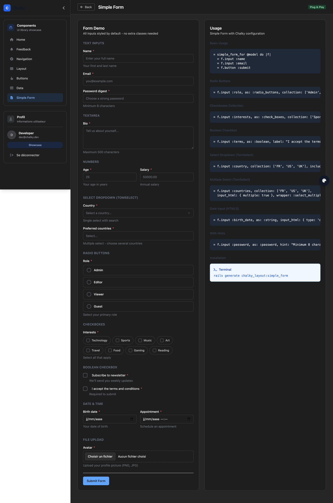

### Basic Usage

```slim
= simple_form_for @model, html: { class: "chalky-form" } do |f|
  = f.input :name, placeholder: "Full name"
  = f.input :email, as: :email
  = f.button :submit, "Save", class: "chalky-button chalky-button--primary"
```

### Input Types

**Text Inputs:**
```slim
= f.input :name                          / Default text input
= f.input :email, as: :email             / Email input
= f.input :password, as: :password       / Password input
= f.input :bio, as: :text                / Textarea
= f.input :age, as: :integer             / Number input
```

**Select with TomSelect (automatic):**
```slim
/ Single select - TomSelect applied automatically via wrapper_mappings
= f.input :country, collection: Country::ALL, include_blank: "Select a country..."

/ The include_blank text becomes the TomSelect placeholder
```

**Multiple Select with TomSelect:**
```slim
= f.input :countries,
  collection: Country::ALL,
  input_html: { multiple: true },
  wrapper: :select_multiple
```

**Radio Buttons:**
```slim
= f.input :role, as: :radio_buttons, collection: ['Admin', 'User', 'Guest']
```

**Checkboxes (collection):**
```slim
= f.input :interests, as: :check_boxes, collection: ['Sports', 'Music', 'Art']
```

**Boolean Checkbox:**
```slim
= f.input :terms, as: :boolean, label: "I accept the terms"
= f.input :newsletter, as: :boolean, label: "Subscribe to newsletter"
```

**Date & Time (HTML5):**
```slim
= f.input :birth_date, as: :string, input_html: { type: "date" }
= f.input :appointment, as: :string, input_html: { type: "datetime-local" }
```

**File Upload:**
```slim
= f.input :avatar, as: :file
```

### Available Wrappers

| Wrapper | Usage | Description |
|---------|-------|-------------|
| `:default` | Text, email, password, etc. | Standard input with label, hint, error |
| `:select` | Single select | Auto-applied, includes TomSelect |
| `:select_multiple` | Multiple select | Must specify explicitly |
| `:radio_buttons` | Radio button groups | Card-style vertical layout |
| `:check_boxes` | Checkbox collections | Pill/tag horizontal layout |
| `:boolean` | Single boolean checkbox | Inline label |
| `:file` | File inputs | Dashed border upload style |

### CSS Classes

| Element | Class |
|---------|-------|
| Form | `.chalky-form` |
| Label | `.chalky-label` |
| Input | `.chalky-input` |
| Select | `.chalky-select` |
| Radio group | `.chalky-radio-group` |
| Checkbox group | `.chalky-checkbox-group` |
| Boolean checkbox | `.chalky-checkbox-wrapper` |
| File input | `.chalky-file-input` |
| Hint | `.chalky-hint` |
| Error | `.chalky-error` |
| Error state | `.chalky-input--error`, `.chalky-select--error` |

### TomSelect Features

- **Search**: Type to filter options
- **Placeholder**: From `include_blank` option
- **Tags**: Multiple selections displayed as removable tags
- **Keyboard navigation**: Full keyboard support
- **Theming**: Automatic via CSS custom properties

### Complete Form Example

```slim
= simple_form_for @user, html: { class: "chalky-form" } do |f|
  = f.error_notification

  .grid.grid-cols-2.gap-4
    = f.input :first_name
    = f.input :last_name

  = f.input :email, as: :email
  = f.input :country, collection: Country::ALL, include_blank: "Select..."
  = f.input :skills, collection: Skill::ALL, input_html: { multiple: true }, wrapper: :select_multiple
  = f.input :role, as: :radio_buttons, collection: Role::ALL
  = f.input :interests, as: :check_boxes, collection: Interest::ALL
  = f.input :terms, as: :boolean, label: "I accept the terms"

  .flex.gap-3
    = f.button :submit, "Save", class: "chalky-button chalky-button--primary"
    = link_to "Cancel", users_path, class: "chalky-button chalky-button--secondary"
```

### Customization

**Custom placeholder for TomSelect:**
```slim
= f.input :country,
  collection: Country::ALL,
  input_html: { data: { placeholder: "Choose a country..." } }
```

**Disable TomSelect on a specific select:**
```slim
= f.input :simple_select,
  collection: options,
  wrapper: :default  / Uses default wrapper without TomSelect
```

---

## Helper Reference

| Helper | Description |
|--------|-------------|
| `chalky_page` | Page wrapper with `with_header` and `with_body` slots |
| `chalky_title_bar` | Standalone title bar |
| `chalky_actions` | Standalone action buttons container |
| `chalky_content` | Standalone content wrapper |
| `chalky_card` | Simple card container |
| `chalky_panel` | Collapsible section with icon |
| `chalky_heading` | Section title with optional icon |
| `chalky_grid` | Responsive data table (supports `pagy:` for pagination) |
| `chalky_pagination` | Standalone pagination component (requires Pagy gem) |
| `chalky_dropdown` | Dropdown menu |
| `chalky_icon_button` | Button with icon |
| `chalky_button` | Form button |
| `chalky_back` | Back navigation |
| `chalky_badge` | Colored status/tag label |
| `chalky_stat` | KPI card for dashboards |
| `chalky_tooltip` | Hover tooltip |
| `chalky_hint` | Small help text |
| `chalky_alert` | Info/warning/error message box |
| `chalky_info_row` | Label/value display pair |
| `chalky_tabs` | Navigation tabs for page sections |
| `chalky_sidebar_layout` | Complete sidebar layout with mobile/desktop support (recommended) |
| `chalky_sidebar_head_script` | Anti-FOUC script for sidebar (place in `<head>`) |

## License

MIT License
